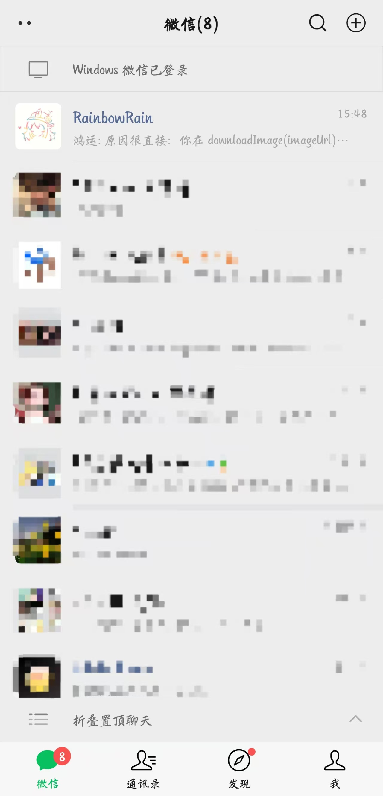
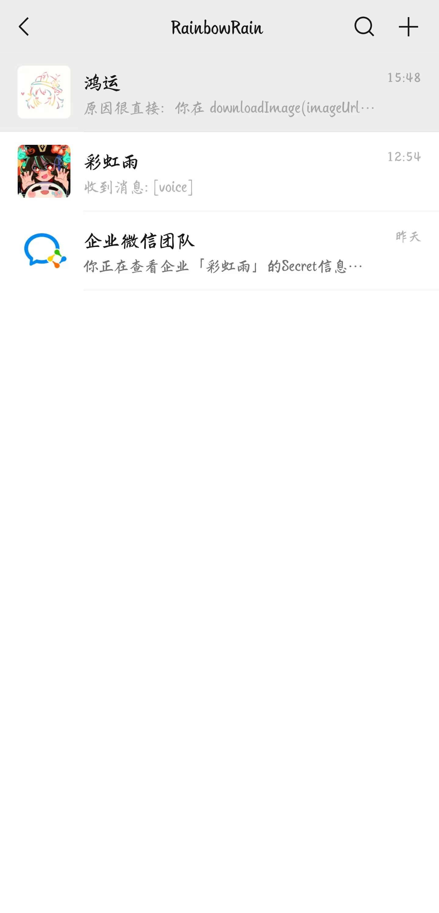

# 企业微信自建应用配置指南

本指南帮助你在企业微信中创建自建应用，并配置 OpenClaw 接入。

## 自建应用 vs 智能机器人

| 功能            | 智能机器人 (wecom) | 自建应用 (wecom-app) |
| :-------------- | :----------------: | :------------------: |
| 被动回复消息    |         ✅         |          ✅          |
| 主动发送消息    |         ❌         |          ✅          |
| 需要企业认证    |         ❌         |          ❌          |
| 需要 corpSecret |         ❌         |          ✅          |
| 需要 IP 白名单  |         ❌         |          ✅          |
| 配置复杂度      |        简单        |         中等         |

**推荐使用自建应用的场景**：

- 需要主动推送消息给用户
- 需要更灵活的消息发送能力
- 需要调用企业微信 API

## 效果展示

<div align="center">

### 微信入口




---

### 对话效果


</div>

---

## 前置条件

1. 一个企业微信账号（可使用个人注册的企业）
2. 公网可访问的 HTTPS 服务器（用于接收回调）
3. OpenClaw 已安装并运行
4. Node.js 和 pnpm（用于构建插件）

---

## 步骤零：安装 wecom-app 插件

### 1. 克隆代码仓库

```bash
cd ~/.openclaw/extensions
git clone https://github.com/RainbowRain9/openclaw-china.git
```

### 2. 进入插件目录并安装依赖

```bash
cd ~/.openclaw/extensions/openclaw-china/extensions/wecom-app
pnpm install
```

### 3. 构建插件

```bash
pnpm build
```

### 4. 安装到 OpenClaw

```bash
openclaw plugins install -l ~/.openclaw/extensions/openclaw-china/extensions/wecom-app
```

> **提示**：`-l` 参数表示链接模式安装，修改源码后无需重新安装，只需重启 Gateway 即可生效。

### 5. 验证安装

```bash
openclaw plugins list
```

确认 `@openclaw-china/wecom-app` 出现在插件列表中。

---

## 步骤一：创建自建应用

### 1. 登录企业微信管理后台

访问 [企业微信管理后台](https://work.weixin.qq.com/wework_admin/frame) 并登录。

### 2. 创建应用

1. 点击左侧菜单「应用管理」
2. 在「自建」区域点击「创建应用」

   

3. 填写应用信息：

   - **应用名称**：例如 "AI 助手"
   - **应用 logo**：上传一个图标
   - **可见范围**：选择可以使用该应用的部门/成员

  

4. 点击「创建应用」

### 3. 获取应用凭证

创建成功后，进入应用详情页，记录以下信息：

- **AgentId**：应用的唯一标识（如 `1000002`）
- **Secret**：点击查看获取（这就是 `corpSecret`）


### 4. 获取企业 ID

1. 点击左侧菜单「我的企业」
2. 在「企业信息」页面底部找到「企业 ID」
3. 记录这个 ID（这就是 `corpId`）


---

## 步骤二：配置接收消息服务器

### 1. 进入应用设置

1. 在应用详情页，找到「接收消息」设置
2. 点击「设置 API 接收」

### 2. 填写服务器配置

- **URL**：你的公网回调地址，例如 `https://your.domain/wecom-app`
- **Token**：自定义一个字符串，例如 `your-random-token`
- **EncodingAESKey**：点击「随机获取」生成 43 位字符


> ⚠️ **重要**：先配置好 OpenClaw，再点击「保存」，否则验证会失败。


### 3. 配置 IP 白名单

在应用详情页的「企业可信 IP」设置中，添加你服务器的公网 IP 地址。


> 💡 如果不知道服务器 IP，可以先尝试发送消息，查看错误日志获取 IP。

---

## 步骤三：配置 OpenClaw

### 使用命令行配置

**Linux/macOS**：

```bash
openclaw config set channels.wecom-app '{
  "enabled": true,
  "webhookPath": "/wecom-app",
  "token": "your-random-token",
  "encodingAESKey": "your-43-char-encoding-aes-key",
  "corpId": "your-corp-id",
  "corpSecret": "your-app-secret",
  "agentId": 1000002
}' --json
```

**Windows CMD**：

```cmd
openclaw config set channels.wecom-app.enabled true
openclaw config set channels.wecom-app.webhookPath /wecom-app
openclaw config set channels.wecom-app.token your-random-token
openclaw config set channels.wecom-app.encodingAESKey your-43-char-encoding-aes-key
openclaw config set channels.wecom-app.corpId your-corp-id
openclaw config set channels.wecom-app.corpSecret your-app-secret
openclaw config set channels.wecom-app.agentId 1000002
```

### 或直接编辑配置文件

编辑 `~/.openclaw/openclaw.json`：

```json
{
  "channels": {
    "wecom-app": {
      "enabled": true,
      "webhookPath": "/wecom-app",
      "token": "your-random-token",
      "encodingAESKey": "your-43-char-encoding-aes-key",
      "corpId": "your-corp-id",
      "corpSecret": "your-app-secret",
      "agentId": 1000002
    }
  }
}
```

### 配置说明

| 字段               | 必填 | 说明                                            |
| :----------------- | :--: | :---------------------------------------------- |
| `enabled`        |  ✅  | 是否启用该渠道                                  |
| `webhookPath`    |  ✅  | 回调路径，需与企业微信后台配置一致              |
| `token`          |  ✅  | 消息校验 Token，需与企业微信后台配置一致        |
| `encodingAESKey` |  ✅  | 消息加密密钥（43 位），需与企业微信后台配置一致 |
| `corpId`         |  ✅  | 企业 ID                                         |
| `corpSecret`     |  ✅  | 应用的 Secret                                   |
| `agentId`        |  ✅  | 应用的 AgentId                                  |
| `welcomeText`    |  ❌  | 用户首次进入时的欢迎语                          |

---

## 步骤四：重启 Gateway

```bash
openclaw gateway restart
```

---

## 步骤五：验证配置

### 1. 回到企业微信后台保存配置

现在 OpenClaw 已启动，回到企业微信后台的「接收消息」设置，点击「保存」。

如果配置正确，会提示保存成功。

### 2. 测试消息收发

1. 在企业微信 App 中打开你创建的应用
2. 发送一条消息
3. 查看 OpenClaw 日志确认消息接收
4. 等待 AI 回复

---

## 常见问题

### Q: 保存配置时提示验证失败？

1. 检查 OpenClaw 是否已启动并监听正确端口
2. 确认 `webhookPath` 与后台 URL 路径一致
3. 确认 `token` 和 `encodingAESKey` 与后台配置完全一致
4. 确认服务器公网可访问（可用 `curl` 测试）

### Q: 消息接收成功但发送失败？

1. 检查 `corpId`、`corpSecret`、`agentId` 是否正确
2. 检查是否已配置 IP 白名单
3. 查看 OpenClaw 日志获取详细错误信息

### Q: 如何获取服务器 IP 地址？

运行以下命令：

```bash
curl ifconfig.me
```

或查看 OpenClaw 发送消息的错误日志，企业微信会返回需要添加白名单的 IP。

### Q: Token 和 EncodingAESKey 可以自己生成吗？

- **Token**：可以是任意字符串
- **EncodingAESKey**：必须是 43 位的 Base64 字符，建议使用企业微信后台的「随机获取」功能

---

## 高级配置

### 访问控制

```json
{
  "channels": {
    "wecom-app": {
      "enabled": true,
      "dmPolicy": "open",
      "groupPolicy": "open",
      "requireMention": false,
      "allowFrom": [],
      "groupAllowFrom": []
    }
  }
}
```

| 字段               | 说明                                                                        |
| :----------------- | :-------------------------------------------------------------------------- |
| `dmPolicy`       | 私聊策略：`open`（任何人）/ `allowlist`（白名单）                       |
| `groupPolicy`    | 群聊策略：`open`（任何群）/ `allowlist`（白名单）/ `disabled`（禁用） |
| `requireMention` | 群聊是否需要 @机器人                                                        |
| `allowFrom`      | 私聊白名单用户 ID 列表                                                      |
| `groupAllowFrom` | 群聊白名单群 ID 列表                                                        |

### 多账户配置

如需配置多个自建应用，可以使用 accounts 对象（键为账户 ID）：

```json
{
  "channels": {
    "wecom-app": {
      "enabled": true,
      "accounts": {
        "app1": {
          "webhookPath": "/wecom-app-1",
          "token": "token-1",
          "encodingAESKey": "key-1",
          "corpId": "corp-id",
          "corpSecret": "secret-1",
          "agentId": 1000002
        },
        "app2": {
          "webhookPath": "/wecom-app-2",
          "token": "token-2",
          "encodingAESKey": "key-2",
          "corpId": "corp-id",
          "corpSecret": "secret-2",
          "agentId": 1000003
        }
      }
    }
  }
}
```

---

## 相关链接

- [企业微信开发文档](https://developer.work.weixin.qq.com/document/)
- [企业微信管理后台](https://work.weixin.qq.com/wework_admin/frame)
- [OpenClaw 文档](https://github.com/OpenClawAI/OpenClaw)
